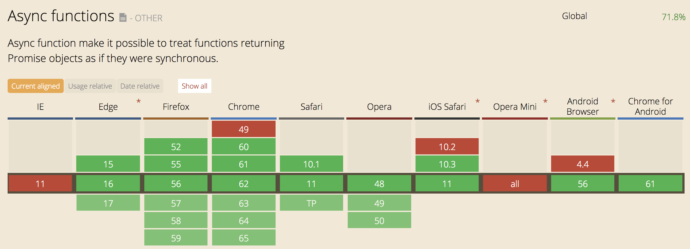
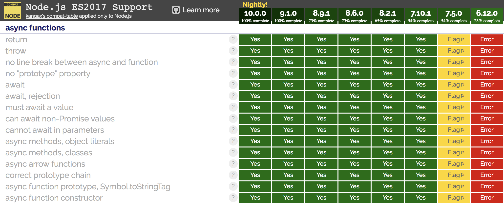

# Why create async/await?

## Callbacks
```js
function doSomeAsyncStuff(done) {
  getData(function(err, x) {
    if (err) return done(err);
    return getMoreData(x, function(err, y) {
      if (err) return done(err);
      return getMoreData(y, function(err, z) {
        if (err) return done(err);
        return done(null, z);
      });
    });
  });
}
```
- Harder to read, harder to debug, especially for newbies
- Convention cb(err, result) not necessarily obvious
- Doesn't feel the same as reading synchronous code
- More prone to errors?

## Async utility modules
```js
const async = require('async');

async.waterfall(
  [
    function(callback) {
      callback(null, 'one', 'two');
    },
    function(arg1, arg2, callback) {
      callback(null, 'three');
    },
    function(arg1, callback) {
      callback(null, 'done');
    },
  ],
  function(err, result) {},
);
```

- Using an external module not standard JS features
- You need to read the documentation of that library
- This code will be transformed
- Will it be performant? Will it be optimized by v8? Who knows...
- Still doesn't feel like reading synchronous code


## Promises

Example where you can't just sequentially `.then()` or you'll create a closure and won't be able to access `valueA` inside `functionC(valueA, valueB)`
```js
// Not working
function executeAsyncTask() {
  return functionA()
    .then(valueA => functionB(valueA))
    .then(valueB => functionC(valueA, valueB))
    // valueA is undefined ⬆️
  }).catch(err => console.log(err));
}
```
Better with the Promises "Christmas tree" 🎄?
```js
function executeAsyncTask() {
  return functionA().then(valueA => {
    return functionB(valueA).then(valueB => {
      return functionC(valueA, valueB);
    });
  }).catch(err => console.log(err));
}
```

Better with variables at the top?
```js
function executeAsyncTask() {
  let valueA;
  return functionA()
    .then(v => {
      valueA = v;
      return functionB(valueA);
    })
    .then(valueB => {
      return functionC(valueA, valueB);
    })
    .catch(err => console.log(err));
}
```


# Async/await
Spec: https://tc39.github.io/ecmascript-asyncawait/
```js
// async keyword before declaring an async function
async function getPageTitle(url) {
  try {
    // stop here until request is resolved
    const response = await request(url);
    // wait here until request has been resolved before returning the response
    return response;
  } catch (err) {
    // catch if the request() is rejected or
    // any errors are thrown
    return err;
  }
}
```

## Where can I use it?
Browsers [https://caniuse.com/#feat=async-functions](https://caniuse.com/#feat=async-functions)

Node [http://node.green](http://node.green/)


With Babel you need to [transform async to generators](https://babeljs.io/docs/plugins/transform-async-to-generator/) that will make it work on `node` > 4.
You can use [ES2017 preset](https://babeljs.io/docs/plugins/preset-es2017/) that includes this.

## How it works?

Every `async` function works with an underlying `Promise` and so it will always return a `Promise` that can be consumed as you are used to.
```js
async function getPage(id) {
  return await request(`/pages/${id}`);
}

getPage(1)
  .then(response => console.log(response))
  .catch(err => console.log(err));

```

## Stuff to pay attention
- Calling `await` inside a function that doesn't have the keyword `async` will throw an error
- You can't call `await` at the top level at the moment in node and all the browsers except Chrome.

## Patterns / control flow / concurrency
This will take 1000ms total
```js
async function series() {
  await wait(500);
  await wait(500);
  return 'done!';
}
```
This instead would take only 500ms total
```js
async function parallel() {
  const wait1 = wait(500);
  const wait2 = wait(500);
  await wait1;
  await wait2;
  return 'done!';
}
```
`Promise.all[]` still works perfectly
```js
let [resA, resB] = await Promise.all([wait(500), wait(500)])
```
